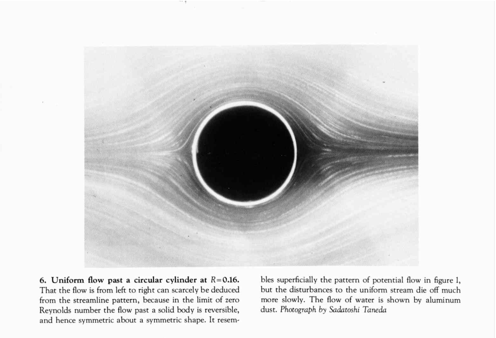
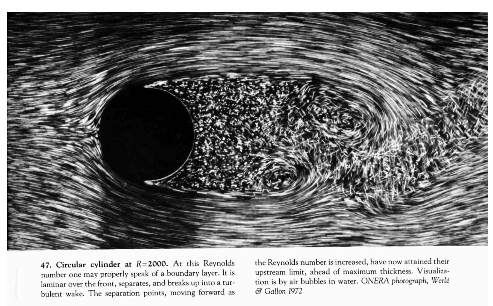

# Viscosity: a first pass

The Euler equation captures the behavior of fluids in a variety of situations. It does well in describing
aerodynamics, as we will see, and it does well in describing strongly turbulent flow away from the 
boundaries of the fluid. 

However, experience teaches us that there is an additional frictional force acting inside the fluid, 
when one *shears* the fluid -- sets up a motion with the velocity changing in space.
If one  initiates flow and then does not force the fluid any further, for example, the fluid will
often slowly come to rest (think about stirring your coffee). This force is known as *viscosity*.

Viscosity plays a sort of dual role in the flow about objects. At low velocities, Euler's equations apply,
and for flows that enter from infinity, initially irrotational fluid stays irrotational.

(Image taken from {cite:p}`van1982album`.)

As we increase the velocity of the incoming fluid a turbulent wave develops behind the cylinder
as we can ee here {cite:p}`van1982album`. 

Clearly the flow ceases to be irrotational behind the cylinder. Now the presence of viscosity will
allow vorticity to develop (as we will see). On the other hand, the viscosity is a
subdominant effect at he scales we're looking at. What is happening is that viscosity becomes
important at the boundary layer surrounding the cylinder. This is because in the presence of viscosity
we must assume that the tangential velocity vanishes at the sphere. A strong shear thus develops 
in a "boundary layer" near the sphere and the viscosity becomes important, allowing the generation 
of vorticity.

This week we will introduce the concept of viscosity and its operation in simple examples, 
but put off a more detailed first-principles argument for the specific form it usually
takes in the usual equations of fluid dynamics.

